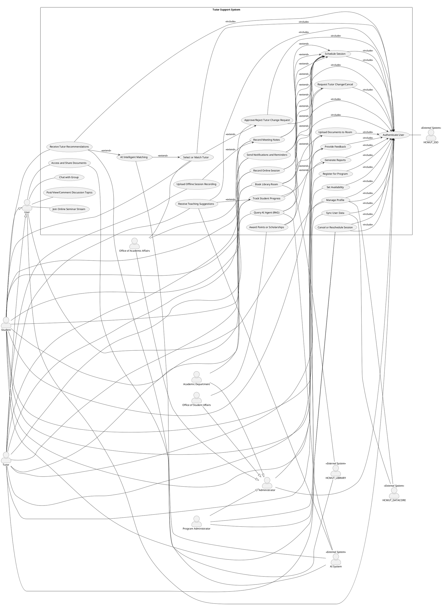

# Dự án Kỹ thuật Phần mềm: Hệ thống Hỗ trợ Tutor tại Đại học Bách khoa TP.HCM

## Giới thiệu

Dự án này là một phần của môn học Kỹ thuật Phần mềm (Software Engineering) tại Trường Đại học Bách khoa – ĐHQG TP.HCM (HCMUT). Hệ thống Hỗ trợ Tutor được thiết kế để quản lý và vận hành chương trình Tutor/Mentor một cách hiệu quả, hiện đại và có khả năng mở rộng, nhằm hỗ trợ sinh viên trong quá trình học tập và phát triển kỹ năng. Hệ thống sẽ được phát triển bằng Next.js cho phần frontend, kết hợp với các công nghệ backend phù hợp (Node.js, Socket), và tích hợp các dịch vụ bên ngoài của HCMUT như HCMUT_SSO, HCMUT_DATACORE và HCMUT_LIBRARY.

Hệ thống cho phép quản lý thông tin tutor và sinh viên, hỗ trợ đăng ký chương trình, ghép đôi tutor, lập lịch buổi tư vấn, đánh giá và báo cáo. Ngoài ra, tích hợp AI cho các tính năng nâng cao như ghép đôi thông minh và hỗ trợ học tập cá nhân hóa (RAG). Các diagram (như Use-case, Sequence, Class) sẽ được hoàn thiện dần trong quá trình phát triển.

### Phạm vi Dự án (Project Scopes)

Phạm vi dự án bao gồm:
- Phát triển MVP (Minimum Viable Product) với các chức năng cốt lõi: Quản lý profile, đăng ký chương trình, lập lịch buổi gặp, thông báo tự động, đánh giá và báo cáo.
- Tích hợp hạ tầng HCMUT: Xác thực qua HCMUT_SSO, đồng bộ dữ liệu từ HCMUT_DATACORE, truy cập tài liệu từ HCMUT_LIBRARY.
- Các tính năng nâng cao: Ghép đôi mentee và mentor thông minh, cộng đồng trực tuyến, hỗ trợ chat nhóm, tham gia seminar, và AI Agent cho hỏi đáp dựa trên tài liệu (RAG).

Mục tiêu là đảm bảo hệ thống an toàn, đồng bộ, và hỗ trợ tối ưu hóa nguồn lực giáo dục, tạo lợi thế cạnh tranh cho HCMUT.

### Yêu cầu Dự án (Project Requirements)

- **Yêu cầu chức năng chính**: Quản lý thông tin người dùng, lập lịch, đánh giá, báo cáo, tích hợp AI và cộng đồng trực tuyến.
- **Yêu cầu phi chức năng**: Bảo mật cao (RBAC qua SSO), khả dụng (truy cập mọi nơi), hiệu suất (thông báo thời gian thực), độ tin cậy (đồng bộ dữ liệu chính xác), và khả năng mở rộng (hỗ trợ AI).
- **Công nghệ**: Next.js cho frontend, Node.js cho backend, PostgreSQL cho database, Socket.io cho real-time, và các dịch vụ HCMUT.
- **Quy trình phát triển**: Agile với các sprint 2 tuần, sử dụng GitHub cho quản lý mã nguồn, Trello cho quản lý công việc, và Discord cho giao tiếp nhóm.
- **Tài liệu**: Bao gồm đặc tả yêu cầu, thiết kế kiến trúc, sơ đồ UML (Use-case, Sequence, Class), và tài liệu người dùng.
- **Thời gian**: Hoàn thành trong 3 tháng (01/09/2025 - 01/12/2025)

### Thành viên Nhóm Phát triển (Developer Team Members)

---
|STT| Họ và Tên          | MSSV  |Lớp | Vai trò chính|
|---|--------------------|-------|----|---------------|
| 1 | Nguyễn Ngọc Ngữ    |2312401|L04 |None           |
| 2 | Phan Đức Nhã       |2312410|L03 |None           |
| 3 | Trần Quốc Nam      |2312197|L03 |None           |
| 4 | Nguyễn Phúc Nhân   |2312438|L03 |None           |
| 5 | Nguyễn Hạo Duy     |2210512|L03 |None           |
| 6 | Lê Nguyễn Anh Duy  |2210505|L03 |None           |
| 7 | Trần Hữu Nguyên Sơn|2312981|L03 |None           |
---

## Chi tiết Đặc tả Dự án (Project Details Specification)

### Bối cảnh Dự án (Project Context)

Tại Trường Đại học Bách khoa – ĐHQG TP.HCM (HCMUT), chương trình Tutor/Mentor được triển khai nhằm hỗ trợ sinh viên trong quá trình học tập và phát triển kỹ năng. Các Tutor có thể là giảng viên, nghiên cứu sinh, hoặc sinh viên năm trên có thành tích học tập tốt, được phân công để hướng dẫn và đồng hành cùng một nhóm sinh viên cụ thể. Nhà trường mong muốn xây dựng một hệ thống phần mềm để quản lý và vận hành chương trình Tutor một cách hiệu quả, hiện đại và có khả năng mở rộng, đáp ứng nhu cầu thực tiễn trong môi trường giáo dục đại học.

Hệ thống cần cho phép quản lý thông tin tutor và sinh viên (hồ sơ cá nhân, lĩnh vực chuyên môn, nhu cầu hỗ trợ), hỗ trợ sinh viên đăng ký tham gia chương trình, lựa chọn hoặc được gợi ý tutor phù hợp. Tutor có thể thiết lập lịch rảnh, mở các buổi tư vấn, và quản lý các buổi gặp gỡ trực tiếp hoặc trực tuyến. Bên cạnh đó, hệ thống hỗ trợ đặt lịch, hủy/đổi lịch, gửi thông báo tự động, nhắc lịch và tổng hợp biên bản buổi gặp (nếu cần). Song song, hệ thống cung cấp công cụ phản hồi và đánh giá: sinh viên phản hồi chất lượng buổi học, tutor theo dõi và ghi nhận tiến bộ của người được kèm, trong khi khoa/bộ môn có thể khai thác dữ liệu đánh giá để nắm tình hình học tập của sinh viên ở các môn cụ thể, phòng Đào tạo sử dụng báo cáo tổng quan nhằm tối ưu phân bổ nguồn lực, và phòng Công tác Sinh viên có thể căn cứ vào kết quả tham gia để cộng điểm rèn luyện hoặc xét học bổng.

Tích hợp hạ tầng công nghệ của HCMUT: Để bảo đảm an toàn và đồng bộ, hệ thống phải tích hợp với dịch vụ xác thực tập trung HCMUT_SSO nhằm quản lý đăng nhập thống nhất cho sinh viên, giảng viên và cán bộ. Dữ liệu cá nhân cơ bản (họ tên, MSSV/ Mã cán bộ, khoa/chuyên ngành, email học vụ, trạng thái học tập/giảng dạy…) được đồng bộ từ HCMUT_DATACORE thông qua dịch vụ chia sẻ dữ liệu, bảo đảm tính chính xác, nhất quán và giảm thiểu thao tác nhập liệu thủ công. Việc phân quyền (sinh viên/tutor/điều phối viên/chủ nhiệm bộ môn/ban quản lý) được ràng buộc theo thông tin vai trò lấy từ hệ thống tập trung của trường. Đồng thời, hệ thống cũng cần kết nối với HCMUT_LIBRARY để cho phép sinh viên và tutor truy cập, chia sẻ tài liệu, sách, và giáo trình liên quan đến buổi học; từ đó tăng tính hỗ trợ học tập, bảo đảm nguồn học liệu chính thống và đồng bộ với cơ sở dữ liệu tài nguyên học tập của toàn trường.

Ngoài các tính năng cốt lõi, hệ thống cũng có thể được mở rộng với các chức năng nâng cao, triển khai tùy theo nhu cầu và nguồn lực: (1) Ghép cặp tutor – sinh viên thông minh (tích hợp AI): hệ thống sử dụng kỹ thuật AI để gợi ý ghép cặp. (2) Cộng đồng trực tuyến cho tutor – mentee. (3) Chương trình tutor học thuật và phi học thuật. (4) Hỗ trợ học tập cá nhân hóa (tích hợp AI).

### Các Bên Liên quan (Relevant Stakeholders)

Các bên liên quan chính được xác định dựa trên bối cảnh dự án, vai trò và kỳ vọng của họ:
- **Sinh viên (Student/Mentee)**: Người dùng chính, cần hỗ trợ học tập, đăng ký chương trình, đặt lịch, đánh giá và truy cập tài liệu. Kỳ vọng: Giao diện dễ sử dụng, thông báo kịp thời, ghép đôi phù hợp.
- **Tutor**: Người hướng dẫn, quản lý lịch trình, theo dõi tiến bộ sinh viên, upload tài liệu. Kỳ vọng: Công cụ hỗ trợ lập lịch, AI gợi ý dạy học, tích hợp chat nhóm.
- **Quản trị viên Cơ sở (Administrator)**: Bao gồm Khoa/Bộ môn (Academic Department), Phòng Đào tạo (Office of Academic Affairs), Phòng Công tác Sinh viên (Office of Student Affairs), và Ban Quản lý Chương trình (Program Administrator). Vai trò: Giám sát báo cáo, phân tích dữ liệu, cộng điểm rèn luyện, phê duyệt thay đổi tutor. Kỳ vọng: Báo cáo chi tiết, tối ưu nguồn lực.
- **Hệ thống Bên ngoài**: HCMUT_SSO (xác thực), HCMUT_DATACORE (đồng bộ dữ liệu), HCMUT_LIBRARY (tài liệu), AI System (ghép đôi và RAG). Những hệ thống này đảm bảo tính nhất quán và bảo mật.

Mục tiêu là đảm bảo tất cả các bên đều được hỗ trợ hiệu quả, với phạm vi rõ ràng để tránh vượt quá nguồn lực.

## Yêu cầu Chức năng (Functional Requirements)

### Sơ đồ Use-case (Use-case Diagram)

Sơ đồ Use-case mô tả toàn bộ hệ thống, bao gồm các actor chính (User với generalization cho Student và Tutor; Administrator với generalization cho các phòng ban), và các use case của hệ thống.

Dưới đây là code PlantUML của sơ đồ:



Sơ đồ này bao quát tất cả actors và use cases, với relationship hợp lý để đảm bảo tính toàn diện.

### Chi tiết Use-case (Use-case Detail)

> Ghi sau

## Yêu cầu Phi Chức năng (Non-functional Requirements)

Các yêu cầu phi chức năng cho toàn hệ thống:
- **Bảo mật (Security)**: Xác thực thống nhất qua HCMUT_SSO, phân quyền RBAC (Role-Based Access Control), bảo vệ dữ liệu cá nhân theo tiêu chuẩn GDPR-like.
- **Khả dụng (Usability)**: Giao diện thân thiện, responsive trên web/mobile (Next.js), thời gian phản hồi <2 giây.
- **Hiệu suất (Performance)**: Hỗ trợ ít nhất 1000 người dùng đồng thời, thông báo push thời gian thực.
- **Độ tin cậy (Reliability)**: Đồng bộ dữ liệu chính xác 99%, auto backup, xử lý lỗi (e.g., session không dùng tự release).
- **Khả năng mở rộng (Scalability)**: Dễ tích hợp AI mới, hỗ trợ tăng số lượng user mà không thay đổi core.
- **Tính khả duy trì (Maintainability)**: Code clean, document đầy đủ, sử dụng Next.js cho dễ update.
- **Tính di động (Portability)**: Chạy trên các nền tảng web hiện đại, không phụ thuộc OS.

Những yêu cầu này đảm bảo hệ thống hiện đại và phù hợp môi trường giáo dục.

## Getting Started

First, run the development server:

```bash
npm run dev
```

Open [http://localhost:3000](http://localhost:3000) with your browser to see the result.

You can start editing the page by modifying `app/page.tsx`. The page auto-updates as you edit the file.

This project uses [`next/font`](https://nextjs.org/docs/app/building-your-application/optimizing/fonts) to automatically optimize and load [Geist](https://vercel.com/font), a new font family for Vercel.

## Deploy on Vercel

The easiest way to deploy your Next.js app is to use the [Vercel Platform](https://vercel.com/new?utm_medium=default-template&filter=next.js&utm_source=create-next-app&utm_campaign=create-next-app-readme) from the creators of Next.js.

Check out our [Next.js deployment documentation](https://nextjs.org/docs/app/building-your-application/deploying) for more details.
